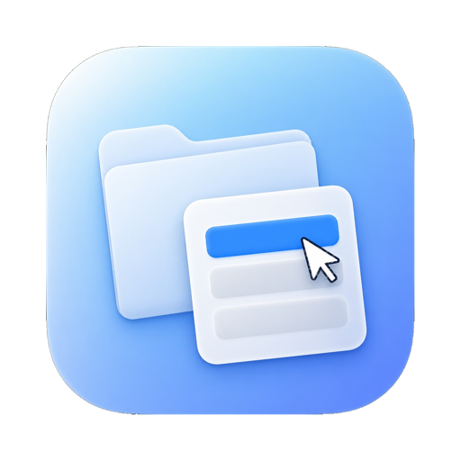
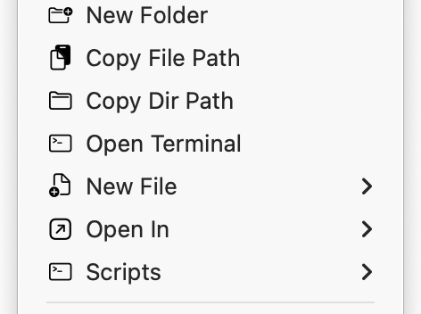
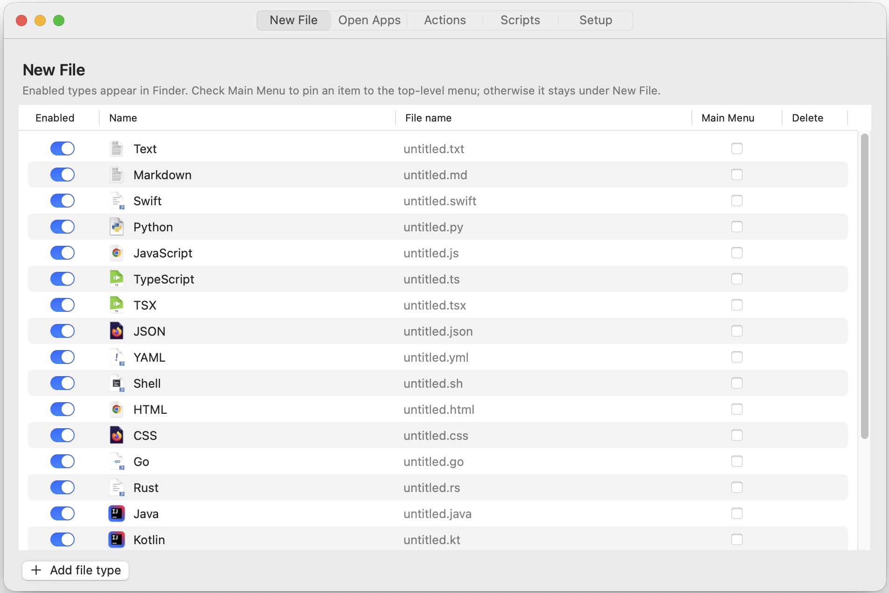
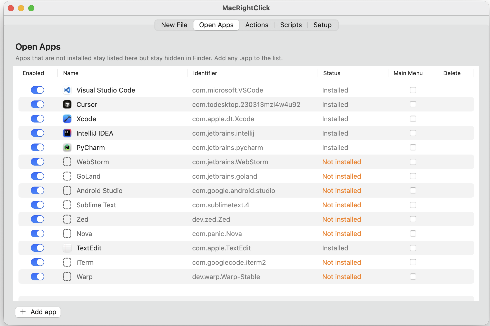
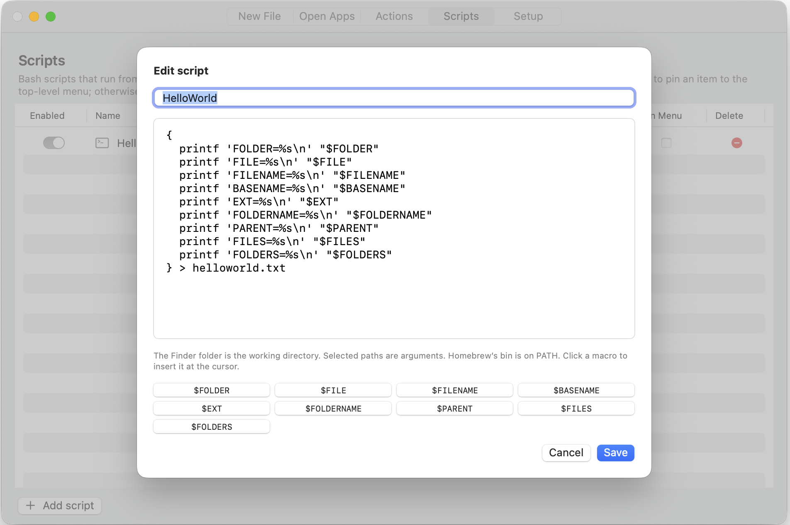

# MacRightClick

  

<h1 align="center">Your Finder menu, built by you.</h1>

  Create files, open the selection in any app, run a script, or copy a path — from the right-click menu you already use.

  <a href="https://github.com/aishiqi/MacRightClick/releases/latest/download/MacRightClick-1.0.0.dmg"><strong>Download for Mac</strong></a>
  ·
  <a href="https://aishiqi.github.io/MacRightClick/">Website</a>

  Version 1.0.0 · macOS 14 or later · Developer ID notarized

  

## Features

**New File** — Text, Markdown, Swift, Python, and your own types, created in the folder you clicked.

**Open In** — Send the selection to VS Code, Cursor, Xcode, Terminal, or any app you add.

**Scripts** — Run a bash script on the file or folder you clicked.

**Actions** — New folder, copy file or directory path, open Terminal. Pin what you use to the top level.

## Screenshots

## Install

1. **Download** the disk image and open it.
2. **Drag** MacRightClick onto Applications.
3. **Activate** the Finder extension in Setup.
